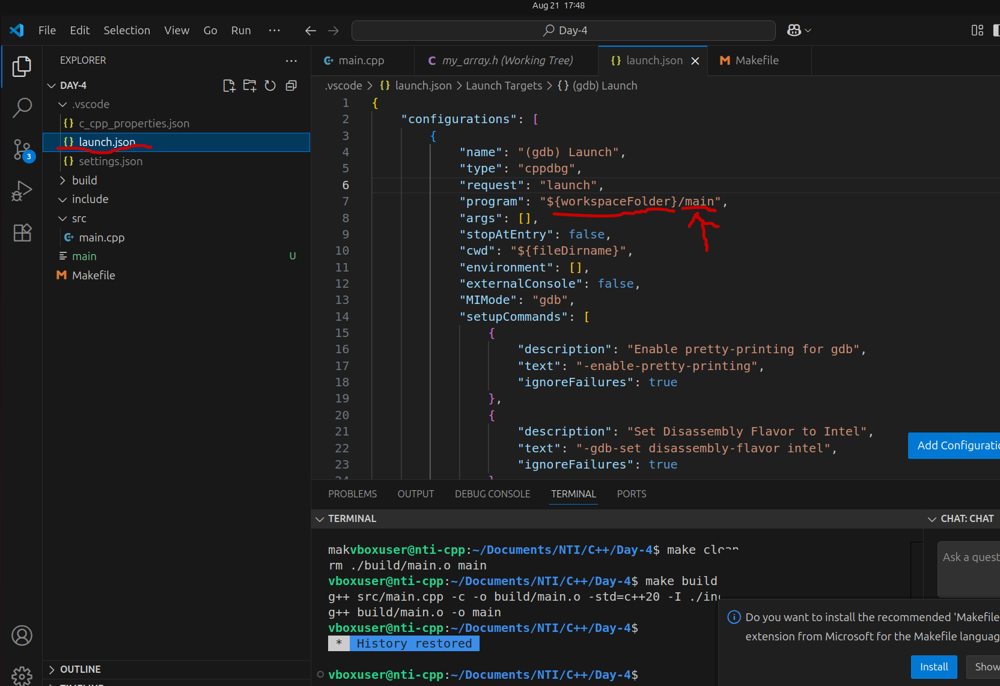

# NTI C++ 2025
Repository for NTI Embedded Linux (C++ section) 2025 training

You can find the training files in the folder C++.

## Instructions for debugging in VS Code

1. Click the gear icon to add a debug configuration. If you can't see this icon make sure you are in a cpp file.

2. Choose the option `(gdb) Launch`

3. A new file called `launch.json` will be generated in the ".vscode" folder. Open this file and change the option called "program" as shown in the image. Replace the name "main" with whatever name you have given to your program

4. :warning: For trainees using Windows, you also have to add the debugger path as `gdb.exe`

5. :warning: Make sure that you add the `-g` compiler flag in the Makefile as shown in the image

6. Clean and build your program

7. Add a breakpoint and start debugging using the `(gdb) Launch` option to test if the debugger is working

